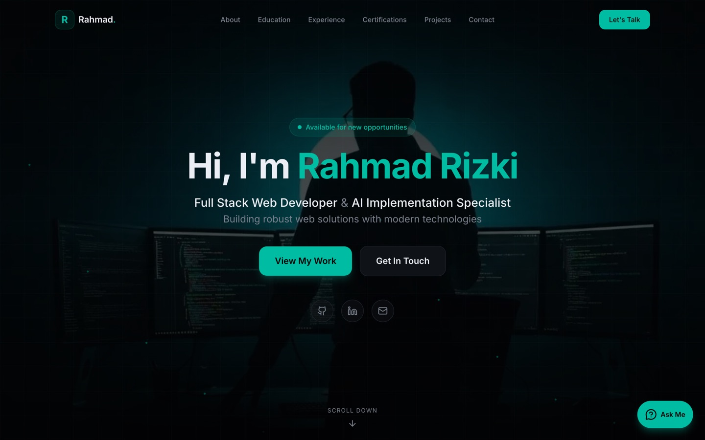

# Portfolio — Rahmad Rizki

Personal portfolio site with an AI assistant that answers visitors' questions
about my background, built on Next.js and deployed to Cloudflare.

**[rizky-portfolio.pages.dev](https://rizky-portfolio.pages.dev/)**



## What is interesting here

### An AI assistant that answers from my actual resume

Visitors can ask the chat widget anything about my experience, skills, or
certificates, in English or Indonesian. It answers only from my resume and says
so plainly when it does not know, rather than inventing an answer.

The interesting part is where the work happens. My resume lives in a Google Doc,
and the certificates in it are images — scans that only a vision model can read.
The obvious implementation sends that document to the model with every message,
which is what this did at first, and it cost about 40 seconds per reply for a
reading that came out identical every time.

So the reading moved to the moment the document changes. A GitHub Actions job
hashes the document hourly and, only when it actually changed, has Gemini
transcribe it once into `content/resume.json` and commits the result. Answering a
visitor is then a small text prompt against 8KB of Markdown.

**Replies went from ~49s to ~2s**, and I still update my resume the same way as
before: by pasting into the Google Doc.

### Performance treated as a measured problem

[](https://pagespeed.web.dev/analysis/https-rizky-portfolio-pages-dev/3739kdk2w9?form_factor=mobile)

That is the mobile run — LCP 2.3s, CLS 0, Speed Index 1.2s — and the report
behind it is public, so the image links to it. Best Practices sits at 96 because
Cloudflare's own analytics beacon fails with `ERR_BLOCKED_BY_CLIENT`; turning it
off would buy the last four points at the cost of having no analytics at all.

Getting there meant measuring rather than guessing, and being wrong twice. The
chatbot's latency looked like a payload problem — 2.2MB going over the wire per
message — but that transfer turned out to be under 5% of the time. Later, mobile
LCP sat at 3.5s while desktop was already perfect; the cause was not the network
either, but the hero subtitle's own fade-in animation, which starts at
`opacity: 0` and therefore does not count as painted. The metric was waiting on
a CSS animation.

The remaining fixes came from reading the LCP breakdown instead of the summary:
render-blocking stylesheets accounted for most of what was left.

### Resilience where it actually failed

The chatbot once went down completely because its Upstash Redis database had
disappeared, and the rate limiter — a guard rail, not a feature — threw before
Gemini was ever reached. Redis is now optional at runtime: the rate limiter fails
open, and a spent Gemini quota or a busy model falls through to a second model
rather than surfacing as an error.

## Built with

Next.js 16 (App Router) · React 19 · TypeScript · Tailwind CSS v4 · shadcn/ui ·
Framer Motion · Gemini · Upstash Redis · Cloudflare Pages

## Running it locally

```bash
npm install
cp .env.example .env.local   # fill in the four values
npm run dev
```

The site renders without any environment variables; only the chat widget needs
them. `npm run resume:sync` re-transcribes the resume, and `npm test` runs the
unit tests.

## Contact

- Email: rizky.business7@gmail.com
- [LinkedIn](https://linkedin.com/in/rahmad-rizki-1728a6186) · [GitHub](https://github.com/rizky-rahmad) · [WhatsApp](https://wa.me/6282365434655)
