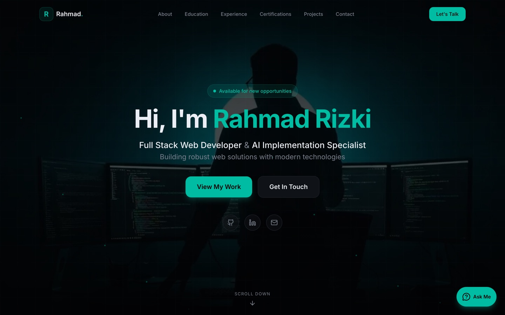
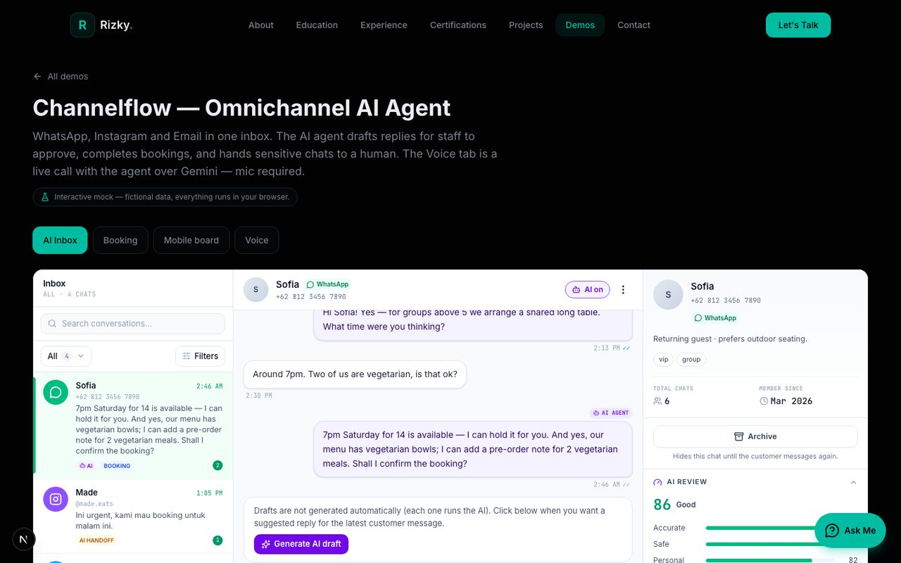
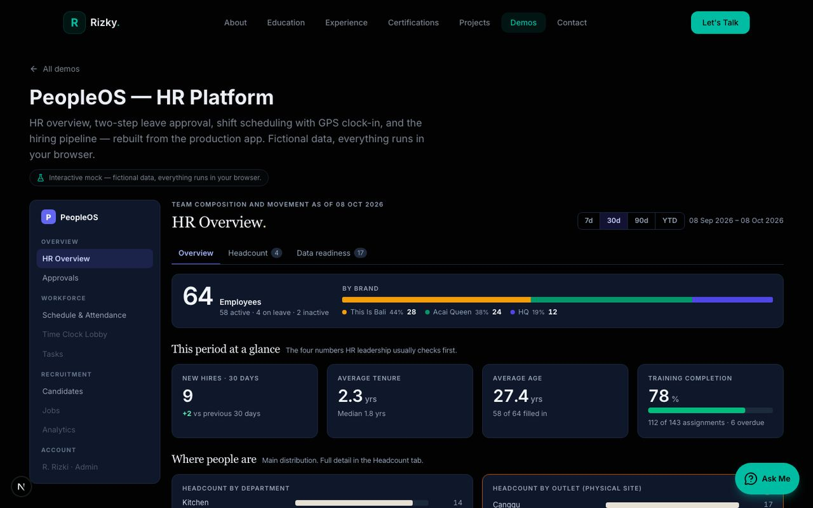
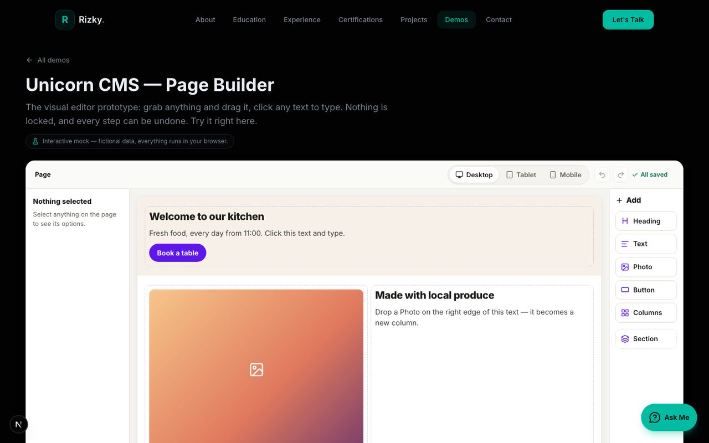

# Rizky — Portfolio, AI Assistant & Interactive Demos

Personal portfolio site with an AI assistant that answers visitors' questions
about my background, and working front-end replicas of the products I built —
all running in the browser. Next.js on Cloudflare Pages.

[](https://rizky-portfolio.pages.dev/)
[](https://pagespeed.web.dev/analysis/https-rizky-portfolio-pages-dev/3739kdk2w9?form_factor=mobile)
[](https://nextjs.org/)
[](https://ai.google.dev/)



## Contents

- [Try it](#try-it)
- [An AI assistant that answers from my actual resume](#an-ai-assistant-that-answers-from-my-actual-resume)
- [Performance treated as a measured problem](#performance-treated-as-a-measured-problem)
- [Try the work, not just read about it](#try-the-work-not-just-read-about-it)
- [Resilience where it actually failed](#resilience-where-it-actually-failed)
- [Built with](#built-with)
- [Running it locally](#running-it-locally)
- [Contact](#contact)

## Try it

- **Live site:** [rizky-portfolio.pages.dev](https://rizky-portfolio.pages.dev/)
- **Interactive demos:** [/demos](https://rizky-portfolio.pages.dev/demos) — inbox,
  booking, HR flows, CMS playground, and a live voice call with the agent.
- **Locally:** `npm run dev`, then `npm run demo:audit` checks every demo with
  Playwright and fails on console errors or broken flows.

## What is interesting here

### An AI assistant that answers from my actual resume

Visitors can ask the chat widget anything about my experience, skills, or
certificates, in English or Indonesian. It answers only from my resume and says
so plainly when it does not know, rather than inventing an answer.

The interesting part is where the work happens. My resume lives in a Google Doc,
and the certificates in it are images — scans that only a vision model can read.
The obvious implementation sends that document to the model with every message,
which is what this did at first, and it cost about 40 seconds per reply for a
reading that came out identical every time.

So the reading moved to the moment the document changes. A GitHub Actions job
hashes the document hourly and, only when it actually changed, has Gemini
transcribe it once into `content/resume.json` and commits the result. Answering a
visitor is then a small text prompt against 8KB of Markdown.

**Replies went from ~49s to ~2s**, and I still update my resume the same way as
before: by pasting into the Google Doc.

### Performance treated as a measured problem

[](https://pagespeed.web.dev/analysis/https-rizky-portfolio-pages-dev/3739kdk2w9?form_factor=mobile)

That is the mobile run — LCP 2.3s, CLS 0, Speed Index 1.2s — and the report
behind it is public, so the image links to it. Best Practices sits at 96 because
Cloudflare's own analytics beacon fails with `ERR_BLOCKED_BY_CLIENT`; turning it
off would buy the last four points at the cost of having no analytics at all.

Getting there meant measuring rather than guessing, and being wrong twice. The
chatbot's latency looked like a payload problem — 2.2MB going over the wire per
message — but that transfer turned out to be under 5% of the time. Later, mobile
LCP sat at 3.5s while desktop was already perfect; the cause was not the network
either, but the hero subtitle's own fade-in animation, which starts at
`opacity: 0` and therefore does not count as painted. The metric was waiting on
a CSS animation.

The remaining fixes came from reading the LCP breakdown instead of the summary:
render-blocking stylesheets accounted for most of what was left.

### Try the work, not just read about it

Each featured project has an **Interactive Demo** link that opens a working mock
at `/demos`. These are rebuilt front-end replicas with fictional data — the
production code stays private, but the interactions are the real ones. They are
covered by a Playwright audit (`npm run demo:audit`, needs `npm run dev` on
:3000) that fails on console errors or broken flows.

| Channelflow — AI inbox | PeopleOS — HR overview | Unicorn CMS — page builder |
|---|---|---|
|  |  |  |
| Approve an AI draft, watch a sensitive chat hand off to a human. | Two-step leave approvals, shift schedule with GPS clock-in, hiring pipeline. | Click to add blocks, drag to reorder, switch devices, undo anything. |

The one exception is the Voice tab: a live call with the agent over Gemini Live
(single-use token per call, 5 calls per hour per visitor, mic required).

### Resilience where it actually failed

The chatbot once went down completely because its Upstash Redis database had
disappeared, and the rate limiter — a guard rail, not a feature — threw before
Gemini was ever reached. Redis is now optional at runtime: the rate limiter fails
open, and a spent Gemini quota or a busy model falls through to a second model
rather than surfacing as an error.

## Built with

| Layer | Technology | Note |
|---|---|---|
| Framework | Next.js 16 (App Router) · React 19 · TypeScript | Path alias `@/*` → repo root |
| UI | Tailwind CSS v4 · shadcn/ui · Framer Motion | `m`, never `motion` (see `components/lazy-motion-provider.tsx`) |
| AI | Gemini over plain REST · Gemini Live for voice | Thinking disabled → replies in ~2s instead of ~6s |
| Data | Upstash Redis | Rate limiting only; optional at runtime by design |
| Hosting | Cloudflare Pages | `images.unoptimized: true`, edge runtime on API routes |

## Running it locally

```bash
npm install
cp .env.example .env.local   # fill in the values below
npm run dev
```

| Variable | Used by | Without it |
|---|---|---|
| `GEMINI_API_KEY` | Chat route, resume sync | Only the chat widget fails; the site renders |
| `GOOGLE_DOC_ID` | Resume sync script only | `npm run resume:sync` cannot fetch the doc |
| `UPSTASH_REDIS_REST_URL` / `UPSTASH_REDIS_REST_TOKEN` | Rate limiting | Limiter fails open; everything works |

`npm run build` is the check before pushing (TypeScript errors are not ignored).
`npm run resume:sync` re-transcribes the resume, `npm test` runs the unit tests,
and `npm run demo:audit` (with the dev server running) checks the interactive
demos.

## Contact

- Email: rizky.business7@gmail.com
- [LinkedIn](https://linkedin.com/in/rahmad-rizki-1728a6186) · [GitHub](https://github.com/rizky-rahmad) · [WhatsApp](https://wa.me/6282365434655)
